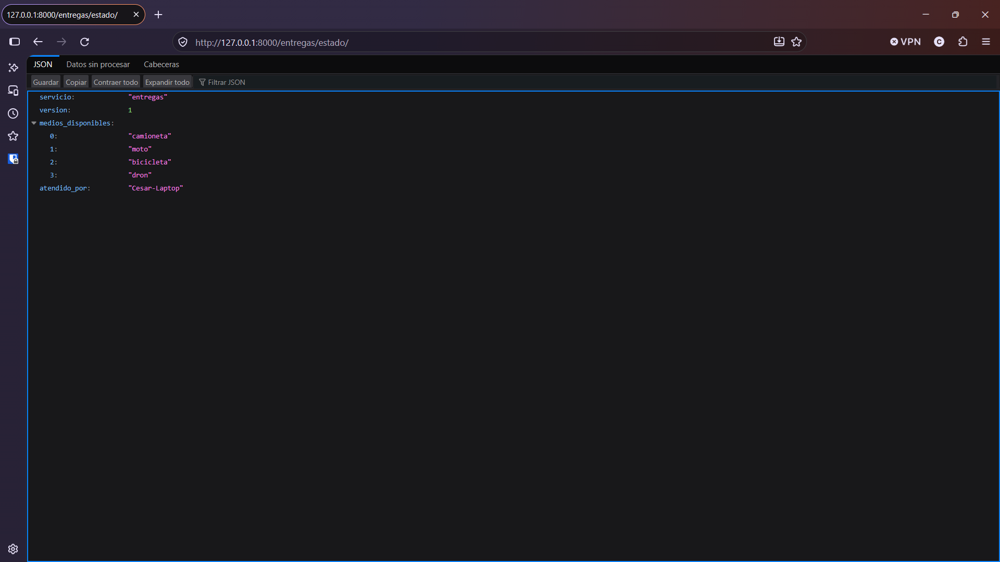
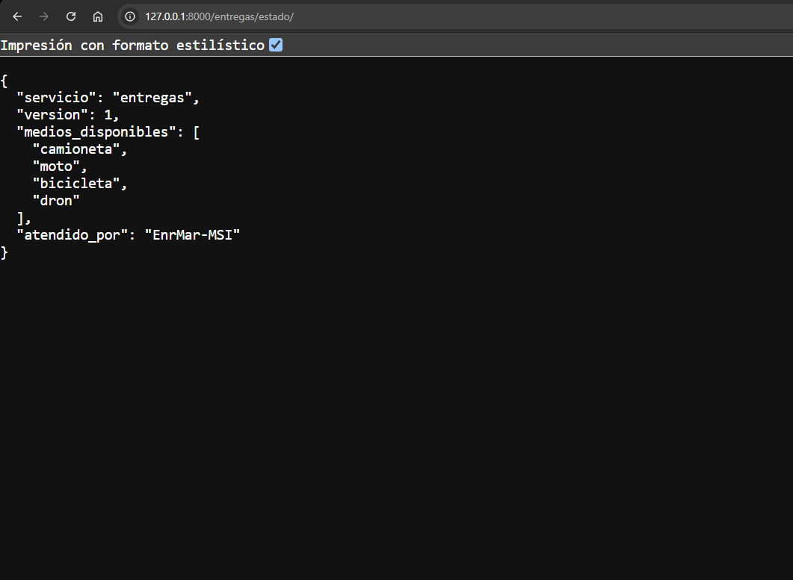
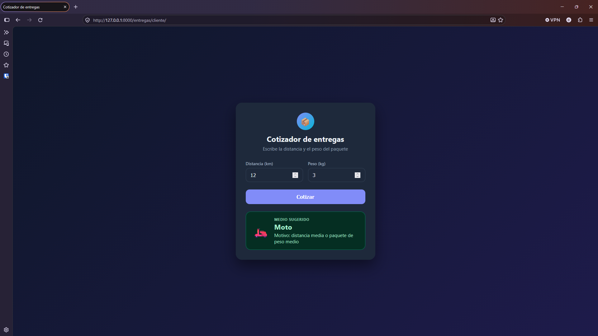
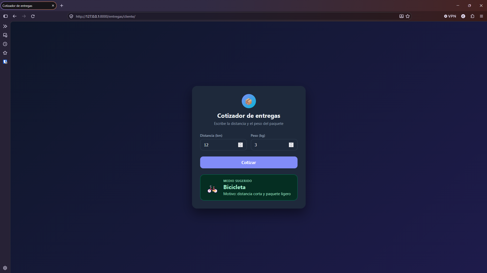

# EXTRA — Retos sobre la ruta de Django

## Integrantes

1. Cesar Enrique Díaz Maldonado
2. Enrique Martinez
3. Adrián Martínez Ortiz
4. (nombre completo)
5. (nombre completo)

---

## Reto 1 — La ruta en todas las computadoras

Cada integrante clonó el repositorio, creó su propio entorno virtual, instaló las dependencias con `pip install -r requirements.txt` y arrancó el servidor con `python manage.py runserver`.

### Resumen

| Integrante                   | Sistema operativo | Entorno virtual activo | Captura de `/entregas/estado/`                 |
| ---------------------------- | ----------------- | ---------------------- | ---------------------------------------------- |
| Cesar Enrique Díaz Maldonado | Windows           | Sí                     | [captura](evidencias/reto1-cesar-estado.png)   |
| Enrique Martinez             | Windows           | Si                     | [captura](evidencias/reto1-enrique-estado.png) |
| Adrián Martínez Ortiz        | Mac.              | Si.                    | [captura](evidencias/reto1-adrian-estado.png)  |
| (integrante 4)               | (pendiente)       | (pendiente)            | (pendiente)                                    |
| (integrante 5)               | (pendiente)       | (pendiente)            | (pendiente)                                    |

### Evidencias de Cesar Enrique Díaz Maldonado

Comandos usados (Windows, `cmd`):

```
git clone https://github.com/Cesaredmyt/proyectoEntregaTopicos.git
cd proyectoEntregaTopicos
py -3.12 -m venv .venv
.venv\Scripts\activate.bat
pip install -r requirements.txt
python -c "import sys; print(sys.prefix)"
python manage.py runserver
```

Salida de `python -c "import sys; print(sys.prefix)"` con el entorno activo:

```
C:\Users\dcesa\OneDrive\Documents\Tec\Topicos Web y Movil\Proyectos\proyectoEntregaTopicos\proyectoEntregaTopicos\.venv
```

El servidor arrancó y respondió `GET /entregas/estado/ HTTP/1.1 200`:



### Evidencias de Enrique Martinez

Comandos usados (Windows, `PowerShell`):

```
git clone https://github.com/Cesaredmyt/proyectoEntregaTopicos.git
cd proyectoEntregaTopicos
py -3.12 -m venv .venv
.venv\Scripts\activate.bat
pip install -r requirements.txt
python -c "import sys; print(sys.prefix)"
python manage.py runserver
```

Salida de `python -c "import sys; print(sys.prefix)"` con el entorno activo:

```
C:\Users\enriq\proyectoEntregaTopicos\.venv
```

El servidor arrancó y respondió `GET /entregas/estado/ HTTP/1.1 200`:



### Diferencias entre sistemas operativos

---

## Reto 2 — Una cotización que entrega datos

Se agregó la dirección `/entregas/cotizar/`, que recibe la distancia y el peso del paquete en la dirección misma (por ejemplo `/entregas/cotizar/?km=12&kg=3`) y responde en JSON qué medio de entrega conviene y por qué.

### Regla elegida

- Más de 25 kg: camioneta
- 40 km o más: camioneta
- Hasta 7 km y menos de 8 kg: bicicleta
- Cualquier otro caso: moto

La regla vive en una función aparte (`entregas/reglas.py`). La vista solo lee los datos de la petición, los valida, llama a esa función y devuelve el JSON.

### Código

`entregas/reglas.py`:

```python
def elegir_medio(km, kg):
    if kg > 25:
        return "camioneta", "paquete pesado (más de 25 kg)"
    if km >= 40:
        return "camioneta", "distancia larga (40 km o más)"
    if km <= 7 and kg < 8:
        return "bicicleta", "distancia corta y paquete ligero"
    return "moto", "distancia media o paquete de peso medio"
```

`entregas/views.py` (imports nuevos y la vista `cotizar`):

```python
import math
from .reglas import elegir_medio


def cotizar(request):
    try:
        km = float(request.GET.get("km"))
        kg = float(request.GET.get("kg"))
    except (TypeError, ValueError):
        return JsonResponse(
            {"error": "km y kg son obligatorios y deben ser numeros"},
            status=400,
        )

    if not (math.isfinite(km) and math.isfinite(kg)) or km < 0 or kg < 0:
        return JsonResponse(
            {"error": "km y kg deben ser números positivos"},
            status=400,
        )

    medio, motivo = elegir_medio(km, kg)
    return JsonResponse({"km": km, "kg": kg, "medio": medio, "motivo": motivo})
```

`entregas/urls.py` (línea agregada dentro de `urlpatterns`):

```python
path("cotizar/", views.cotizar, name="cotizar"),
```

Los datos de la dirección llegan como texto, por eso se convierten con `float()`. Si falta `km` llega `None` (`TypeError`), y si escriben `abc` falla la conversión (`ValueError`). Además se descartan `nan`, `inf` y los números negativos.

### Pruebas

Prueba 1, correcta (`km=12&kg=3`):

```
curl.exe -i "http://127.0.0.1:8000/entregas/cotizar/?km=12&kg=3"
HTTP/1.1 200 OK
Date: Tue, 06 Oct 2026 00:29:31 GMT
Server: WSGIServer/0.2 CPython/3.12.10
Content-Type: application/json
X-Frame-Options: DENY
Content-Length: 93
X-Content-Type-Options: nosniff
Referrer-Policy: same-origin
Cross-Origin-Opener-Policy: same-origin

{"km": 12.0, "kg": 3.0, "medio": "moto", "motivo": "distancia media o paquete de peso medio"}
```

Prueba 2, sin `km`:

```
curl.exe -i "http://127.0.0.1:8000/entregas/cotizar/?kg=3"
HTTP/1.1 400 Bad Request
Date: Tue, 06 Oct 2026 00:29:40 GMT
Server: WSGIServer/0.2 CPython/3.12.10
Content-Type: application/json
X-Frame-Options: DENY
Content-Length: 57
X-Content-Type-Options: nosniff
Referrer-Policy: same-origin
Cross-Origin-Opener-Policy: same-origin

{"error": "km y kg son obligatorios y deben ser numeros"}
```

Prueba 3, con `km=abc`:

```
curl.exe -i "http://127.0.0.1:8000/entregas/cotizar/?km=abc&kg=3"
HTTP/1.1 400 Bad Request
Date: Tue, 06 Oct 2026 00:29:49 GMT
Server: WSGIServer/0.2 CPython/3.12.10
Content-Type: application/json
X-Frame-Options: DENY
Content-Length: 57
X-Content-Type-Options: nosniff
Referrer-Policy: same-origin
Cross-Origin-Opener-Policy: same-origin

{"error": "km y kg son obligatorios y deben ser numeros"}
```

Comprobación de los bordes de la regla (`elegir_medio(km, kg)`):

| km  | kg  | Medio     |
| --- | --- | --------- |
| 5   | 2   | bicicleta |
| 7   | 7.9 | bicicleta |
| 7   | 8   | moto      |
| 40  | 1   | camioneta |
| 10  | 25  | moto      |
| 10  | 26  | camioneta |

### Preguntas

**1. ¿Por qué la validación tiene que estar en el backend, aunque la app móvil ya revise que el campo no esté vacío?**

Se valida en el backend porque es nuestra última defensa y la más importante. La validación de la app se puede saltar, porque el cliente no lo controlamos: cualquiera puede mandar datos directo al backend con `curl` o con otra aplicación. Si el backend no revisa, un dato malo entra como si nada y llega a la regla o a la base de datos. Por eso se valida en las dos partes, pero en el backend pesa más, porque es lo único por donde pasan todos los clientes.

**2. ¿Qué patrón de los apuntes reemplazaría la cadena de `if` cuando haya que agregar el dron o un quinto medio, y qué ganarían con eso?**

Usaríamos el patrón Strategy. Cada medio de entrega sería una clase con su propia regla, y la función solo recorre la lista y se queda con el primero que sirva. Para agregar el dron se crea una clase nueva y se mete en la lista, sin tocar la bicicleta, la moto ni la camioneta. Con los `if` habría que editar la función cada vez y se podría romper algo que ya funcionaba. Con Strategy el código queda más fácil de leer, de probar y de hacer crecer.

## Reto 3 — Dos clientes, un solo backend

### Cambio de la regla

Se cambió únicamente el límite de kilómetros de la bicicleta en `entregas/reglas.py`, de 7 a 15, sin modificar ninguno de los dos clientes.

Antes:

```python
    if km <= 7 and kg < 8:
        return "bicicleta", "distancia corta y paquete ligero"
```

Después:

```python
    if km <= 15 and kg < 8:
        return "bicicleta", "distancia corta y paquete ligero"
```

### Evidencias

Página web antes del cambio de la regla (resultado: moto):



Salida del programa de Python antes del cambio de la regla:

```
python cliente_movil.py
Medio sugerido: moto
Motivo: distancia media o paquete de peso medio
```

Página web después del cambio de la regla (resultado: bicicleta):



Salida del programa de Python después del cambio de la regla:

```
python cliente_movil.py
Medio sugerido: bicicleta
Motivo: distancia corta y paquete ligero
```

### Pregunta

**Si la regla hubiera estado en el JavaScript de la página, ¿qué habría pasado con el cliente de Python al cambiarla?**

El cambio solo habría afectado a la página web. El cliente de Python no ejecuta ese JavaScript, por lo que habría seguido con la regla anterior o habría necesitado su propia copia, y los dos clientes habrían dado respuestas distintas para el mismo paquete. Para corregirlo sería necesario modificar la regla en cada cliente por separado, y bastaría con olvidar uno para que el sistema se contradiga. Además, las páginas o aplicaciones que siguieran en una versión vieja continuarían usando la regla anterior. Al estar la regla en el backend, en `reglas.py`, basta con cambiar un solo número para que ambos clientes reflejen el cambio al instante, sin modificarlos.

## Reto 4 — Réplicas: hacerlo fallar y arreglarlo

(pendiente)

## Reto 5 — Casos para pensar

(pendiente)
