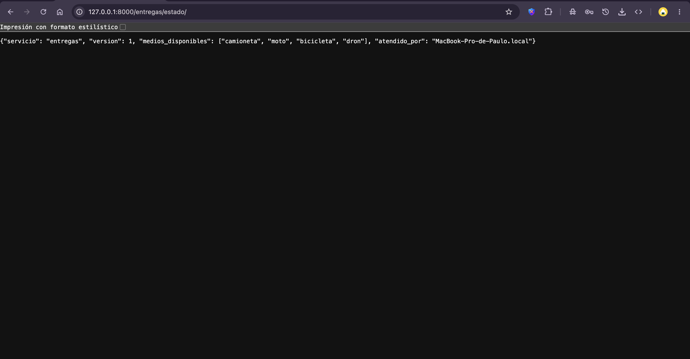

# EXTRA — Retos sobre la ruta de Django

## Integrantes

1. Cesar Enrique Díaz Maldonado
2. Enrique Martinez
3. Adrián Martínez Ortiz
4. José Antonio Medina Ayala
5. Paulo Cesar Perez Martinez

---

## Reto 1 — La ruta en todas las computadoras

Cada integrante clonó el repositorio, creó su propio entorno virtual, instaló las dependencias con `pip install -r requirements.txt` y arrancó el servidor con `python manage.py runserver`.

### Resumen

| Integrante                   | Sistema operativo | Entorno virtual activo | Captura de `/entregas/estado/`                 |
| ---------------------------- | ----------------- | ---------------------- | ---------------------------------------------- |
| Cesar Enrique Díaz Maldonado | Windows           | Sí                     | [captura](evidencias/reto1-cesar-estado.png)   |
| Enrique Martinez             | Windows           | Si                     | [captura](evidencias/reto1-enrique-estado.png) |
| Adrián Martínez Ortiz        | Mac.              | Si.                    | [captura](evidencias/reto1-adrian-estado.png)  |
| José Antonio Medina Ayala    | (pendiente)       | (pendiente)            | [captura](evidencias/reto1-medinaayala-estado.png) |
| Paulo Cesar Perez Martinez   | macOS             | Sí                     | [captura](evidencias/reto1-paulo-estado.png)   |

### Evidencias de Cesar Enrique Díaz Maldonado

Comandos usados (Windows, `cmd`):

```
git clone https://github.com/Cesaredmyt/proyectoEntregaTopicos.git
cd proyectoEntregaTopicos
py -3.12 -m venv .venv
.venv\Scripts\activate.bat
pip install -r requirements.txt
python -c "import sys; print(sys.prefix)"
python manage.py runserver
```

Salida de `python -c "import sys; print(sys.prefix)"` con el entorno activo:

```
C:\Users\dcesa\OneDrive\Documents\Tec\Topicos Web y Movil\Proyectos\proyectoEntregaTopicos\proyectoEntregaTopicos\.venv
```

El servidor arrancó y respondió `GET /entregas/estado/ HTTP/1.1 200`:


### Evidencias de Enrique Martinez

Comandos usados (Windows, `PowerShell`):

```
git clone https://github.com/Cesaredmyt/proyectoEntregaTopicos.git
cd proyectoEntregaTopicos
py -3.12 -m venv .venv
.venv\Scripts\activate.bat
pip install -r requirements.txt
python -c "import sys; print(sys.prefix)"
python manage.py runserver
```

Salida de `python -c "import sys; print(sys.prefix)"` con el entorno activo:

```
C:\Users\enriq\proyectoEntregaTopicos\.venv
```

El servidor arrancó y respondió `GET /entregas/estado/ HTTP/1.1 200`:


### Evidencias de Paulo Cesar Perez Martinez

Comandos usados (macOS, `zsh`). El Python 3.9 que trae macOS no sirve para este proyecto (`asgiref 3.12.1` pide Python 3.10 o superior), así que se instaló Python 3.14 desde python.org y se creó el entorno con esa versión:

```
git clone https://github.com/Cesaredmyt/proyectoEntregaTopicos.git
cd proyectoEntregaTopicos
python3.14 -m venv .venv
source .venv/bin/activate
pip install -r requirements.txt
python -c "import sys; print(sys.prefix)"
python manage.py runserver
```

Salida de `python -c "import sys; print(sys.prefix)"` con el entorno activo (Python 3.14.8):

```
/Users/rudy/Documents/TECNM/Semestre 9/TSAPMW/proyectoEntregaTopicos/.venv
```

El servidor arrancó y `/entregas/estado/` respondió con el JSON del servicio (`"atendido_por": "MacBook-Pro-de-Paulo.local"`):



### Diferencias entre sistemas operativos

- **Activar el entorno virtual:** en Windows se usa `.venv\Scripts\activate.bat` (cmd) y en macOS `source .venv/bin/activate`.
- **Crear el entorno:** en Windows se usó el lanzador `py -3.12 -m venv .venv`; en macOS se usa el ejecutable directo, `python3.14 -m venv .venv`. Además, macOS trae un Python 3.9 antiguo, por lo que hubo que instalar una versión más nueva para poder instalar las dependencias.
- **Peticiones desde la terminal:** en Windows PowerShell `curl` es un alias de otro comando, por eso se usa `curl.exe`; en macOS `curl` funciona directo.

---

## Reto 2 — Una cotización que entrega datos

Se agregó la dirección `/entregas/cotizar/`, que recibe la distancia y el peso del paquete en la dirección misma (por ejemplo `/entregas/cotizar/?km=12&kg=3`) y responde en JSON qué medio de entrega conviene y por qué.

### Regla elegida

- Más de 25 kg: camioneta
- 40 km o más: camioneta
- Hasta 7 km y menos de 8 kg: bicicleta
- Cualquier otro caso: moto

La regla vive en una función aparte (`entregas/reglas.py`). La vista solo lee los datos de la petición, los valida, llama a esa función y devuelve el JSON.

### Código

`entregas/reglas.py`:

```python
def elegir_medio(km, kg):
    if kg > 25:
        return "camioneta", "paquete pesado (más de 25 kg)"
    if km >= 40:
        return "camioneta", "distancia larga (40 km o más)"
    if km <= 7 and kg < 8:
        return "bicicleta", "distancia corta y paquete ligero"
    return "moto", "distancia media o paquete de peso medio"
```

`entregas/views.py` (imports nuevos y la vista `cotizar`):

```python
import math
from .reglas import elegir_medio


def cotizar(request):
    try:
        km = float(request.GET.get("km"))
        kg = float(request.GET.get("kg"))
    except (TypeError, ValueError):
        return JsonResponse(
            {"error": "km y kg son obligatorios y deben ser numeros"},
            status=400,
        )

    if not (math.isfinite(km) and math.isfinite(kg)) or km < 0 or kg < 0:
        return JsonResponse(
            {"error": "km y kg deben ser números positivos"},
            status=400,
        )

    medio, motivo = elegir_medio(km, kg)
    return JsonResponse({"km": km, "kg": kg, "medio": medio, "motivo": motivo})
```

`entregas/urls.py` (línea agregada dentro de `urlpatterns`):

```python
path("cotizar/", views.cotizar, name="cotizar"),
```

Los datos de la dirección llegan como texto, por eso se convierten con `float()`. Si falta `km` llega `None` (`TypeError`), y si escriben `abc` falla la conversión (`ValueError`). Además se descartan `nan`, `inf` y los números negativos.

### Pruebas

Prueba 1, correcta (`km=12&kg=3`):

```
curl.exe -i "http://127.0.0.1:8000/entregas/cotizar/?km=12&kg=3"
HTTP/1.1 200 OK
Date: Tue, 06 Oct 2026 00:29:31 GMT
Server: WSGIServer/0.2 CPython/3.12.10
Content-Type: application/json
X-Frame-Options: DENY
Content-Length: 93
X-Content-Type-Options: nosniff
Referrer-Policy: same-origin
Cross-Origin-Opener-Policy: same-origin

{"km": 12.0, "kg": 3.0, "medio": "moto", "motivo": "distancia media o paquete de peso medio"}
```

Prueba 2, sin `km`:

```
curl.exe -i "http://127.0.0.1:8000/entregas/cotizar/?kg=3"
HTTP/1.1 400 Bad Request
Date: Tue, 06 Oct 2026 00:29:40 GMT
Server: WSGIServer/0.2 CPython/3.12.10
Content-Type: application/json
X-Frame-Options: DENY
Content-Length: 57
X-Content-Type-Options: nosniff
Referrer-Policy: same-origin
Cross-Origin-Opener-Policy: same-origin

{"error": "km y kg son obligatorios y deben ser numeros"}
```

Prueba 3, con `km=abc`:

```
curl.exe -i "http://127.0.0.1:8000/entregas/cotizar/?km=abc&kg=3"
HTTP/1.1 400 Bad Request
Date: Tue, 06 Oct 2026 00:29:49 GMT
Server: WSGIServer/0.2 CPython/3.12.10
Content-Type: application/json
X-Frame-Options: DENY
Content-Length: 57
X-Content-Type-Options: nosniff
Referrer-Policy: same-origin
Cross-Origin-Opener-Policy: same-origin

{"error": "km y kg son obligatorios y deben ser numeros"}
```

Comprobación de los bordes de la regla (`elegir_medio(km, kg)`):

| km  | kg  | Medio     |
| --- | --- | --------- |
| 5   | 2   | bicicleta |
| 7   | 7.9 | bicicleta |
| 7   | 8   | moto      |
| 40  | 1   | camioneta |
| 10  | 25  | moto      |
| 10  | 26  | camioneta |

### Preguntas

**1. ¿Por qué la validación tiene que estar en el backend, aunque la app móvil ya revise que el campo no esté vacío?**

Se valida en el backend porque es nuestra última defensa y la más importante. La validación de la app se puede saltar, porque el cliente no lo controlamos: cualquiera puede mandar datos directo al backend con `curl` o con otra aplicación. Si el backend no revisa, un dato malo entra como si nada y llega a la regla o a la base de datos. Por eso se valida en las dos partes, pero en el backend pesa más, porque es lo único por donde pasan todos los clientes.

**2. ¿Qué patrón de los apuntes reemplazaría la cadena de `if` cuando haya que agregar el dron o un quinto medio, y qué ganarían con eso?**

Usaríamos el patrón Strategy. Cada medio de entrega sería una clase con su propia regla, y la función solo recorre la lista y se queda con el primero que sirva. Para agregar el dron se crea una clase nueva y se mete en la lista, sin tocar la bicicleta, la moto ni la camioneta. Con los `if` habría que editar la función cada vez y se podría romper algo que ya funcionaba. Con Strategy el código queda más fácil de leer, de probar y de hacer crecer.

## Reto 3 — Dos clientes, un solo backend

### Cambio de la regla

Se cambió únicamente el límite de kilómetros de la bicicleta en `entregas/reglas.py`, de 7 a 15, sin modificar ninguno de los dos clientes.

Antes:

```python
    if km <= 7 and kg < 8:
        return "bicicleta", "distancia corta y paquete ligero"
```

Después:

```python
    if km <= 15 and kg < 8:
        return "bicicleta", "distancia corta y paquete ligero"
```

### Evidencias

Página web antes del cambio de la regla (resultado: moto):


Salida del programa de Python antes del cambio de la regla:

```
python cliente_movil.py
Medio sugerido: moto
Motivo: distancia media o paquete de peso medio
```

Página web después del cambio de la regla (resultado: bicicleta):


Salida del programa de Python después del cambio de la regla:

```
python cliente_movil.py
Medio sugerido: bicicleta
Motivo: distancia corta y paquete ligero
```

### Pregunta

**Si la regla hubiera estado en el JavaScript de la página, ¿qué habría pasado con el cliente de Python al cambiarla?**

El cambio solo habría afectado a la página web. El cliente de Python no ejecuta ese JavaScript, por lo que habría seguido con la regla anterior o habría necesitado su propia copia, y los dos clientes habrían dado respuestas distintas para el mismo paquete. Para corregirlo sería necesario modificar la regla en cada cliente por separado, y bastaría con olvidar uno para que el sistema se contradiga. Además, las páginas o aplicaciones que siguieran en una versión vieja continuarían usando la regla anterior. Al estar la regla en el backend, en `reglas.py`, basta con cambiar un solo número para que ambos clientes reflejen el cambio al instante, sin modificarlos.

## Reto 4 — Réplicas: hacerlo fallar y arreglarlo

Se hicieron las etapas 4 y 5 completas (tres copias de `web` detrás de nginx, con PostgreSQL) y se fue un paso más allá con el último folio consultado.

Dentro del repositorio ya existían `/entregas/visitas/` (contador en la sesión) y `/entregas/visitas-mal/` (contador en una variable global). Todas las respuestas incluyen `atendido_por`, el nombre del contenedor que atendió la petición.

### Comandos

```
docker compose up --build -d
docker compose ps
```

### Punto 1 — Seis peticiones a `visitas` y seis a `visitas-mal`

```
for i in 1 2 3 4 5 6; do curl -s -c cookies.txt -b cookies.txt http://localhost:8000/entregas/visitas/; echo; done
for i in 1 2 3 4 5 6; do curl -s http://localhost:8000/entregas/visitas-mal/; echo; done
```

Salida de `visitas` (la sesión vive en la base de datos, por eso el contador sube sin saltos aunque cambie la copia):

```
{"atendido_por": "631aec9e74de", "visitas": 1}
{"atendido_por": "ff2617fcbf02", "visitas": 2}
{"atendido_por": "902bbef72111", "visitas": 3}
{"atendido_por": "631aec9e74de", "visitas": 4}
{"atendido_por": "ff2617fcbf02", "visitas": 5}
{"atendido_por": "902bbef72111", "visitas": 6}
```

Salida de `visitas-mal` (cada copia tiene su propio contador en memoria):

```
{"atendido_por": "631aec9e74de", "visitas": 1}
{"atendido_por": "ff2617fcbf02", "visitas": 1}
{"atendido_por": "902bbef72111", "visitas": 1}
{"atendido_por": "631aec9e74de", "visitas": 2}
{"atendido_por": "ff2617fcbf02", "visitas": 2}
{"atendido_por": "902bbef72111", "visitas": 2}
```

Cada copia empieza desde 1 y cuenta solo lo suyo, por eso el contador no refleja el total de visitas.

#### Problema encontrado: nginx mandaba todo a una sola copia

En la primera prueba las 12 respuestas salieron con el mismo `atendido_por`, aunque `docker compose ps` mostraba las tres copias arriba y `getent ahostsv4 web` dentro del balanceador devolvía las tres IP. La causa: nginx arrancó 15 procesos worker y, sin memoria compartida, cada worker lleva su propio turno de round-robin y empieza siempre por el mismo servidor, así que con pocas peticiones casi todas caían en la misma copia. Se arregló agregando `zone django 64k;` al `upstream` en `nginx/default.conf`, para que los workers compartan el estado del balanceo:

```nginx
upstream django {
    zone django 64k;
    server web:8000;
}
```

Después de `docker compose restart balanceador` las peticiones se reparten entre las tres copias, como se ve arriba.

### Punto 2 — El error: último folio en una variable global

Se agregaron `/entregas/ultimo-mal/?folio=ABC123` (guarda el folio) y `/entregas/ultimo-mal/ver/` (lo muestra). Se les puso `-mal` en el nombre, igual que `visitas-mal`, para poder conservar la versión con el error junto a la arreglada.

```python
ultimo_folio_en_memoria = None

def ultimo_mal(request):
    global ultimo_folio_en_memoria
    folio = _leer_folio(request)
    if folio is None:
        return JsonResponse(ERROR_FOLIO, status=400)
    ultimo_folio_en_memoria = folio
    return JsonResponse({"atendido_por": COPIA, "guardado": folio})


def ultimo_ver_mal(request):
    return JsonResponse({"atendido_por": COPIA, "folio": ultimo_folio_en_memoria})
```

Prueba con las tres copias corriendo:

```
curl -s "http://localhost:8000/entregas/ultimo-mal/?folio=ABC123"
for i in 1 2 3 4 5 6; do curl -s http://localhost:8000/entregas/ultimo-mal/ver/; echo; done
```

```
{"atendido_por": "631aec9e74de", "guardado": "ABC123"}
{"atendido_por": "ff2617fcbf02", "folio": null}
{"atendido_por": "902bbef72111", "folio": null}
{"atendido_por": "631aec9e74de", "folio": null}
{"atendido_por": "ff2617fcbf02", "folio": null}
{"atendido_por": "902bbef72111", "folio": null}
{"atendido_por": "631aec9e74de", "folio": null}
```

Qué pasa: el folio se guardó en la memoria de un solo proceso. Las seis consultas dieron `null`, incluso la que respondió la misma copia que lo guardó (`631aec9e74de`), porque cada contenedor corre dos workers de gunicorn (`--workers 2` en el `Dockerfile`) y cada worker tiene su propia memoria; la consulta cayó en el otro worker. Es decir, el error aparece con varias copias y también con varios procesos dentro de una misma copia.

### Punto 3 — El arreglo: el folio vive en la base de datos

Sin variables globales. Se creó un modelo `UltimoFolio` (con su migración `0001_initial.py`) y las vistas `/entregas/ultimo/` y `/entregas/ultimo/ver/` leen y escriben siempre en PostgreSQL, que comparten todas las copias.

`entregas/models.py`:

```python
class UltimoFolio(models.Model):
    folio = models.CharField(max_length=50)
    consultado_en = models.DateTimeField(auto_now=True)
```

`entregas/views.py`:

```python
def ultimo(request):
    folio = _leer_folio(request)
    if folio is None:
        return JsonResponse(ERROR_FOLIO, status=400)
    UltimoFolio.objects.update_or_create(pk=1, defaults={"folio": folio})
    return JsonResponse({"atendido_por": COPIA, "guardado": folio})


def ultimo_ver(request):
    registro = UltimoFolio.objects.filter(pk=1).first()
    return JsonResponse({
        "atendido_por": COPIA,
        "folio": registro.folio if registro else None,
    })
```

Prueba con tres copias:

```
curl -s "http://localhost:8000/entregas/ultimo/?folio=ABC123"
for i in 1 2 3 4 5 6; do curl -s http://localhost:8000/entregas/ultimo/ver/; echo; done
```

```
{"atendido_por": "ff2617fcbf02", "guardado": "ABC123"}
{"atendido_por": "902bbef72111", "folio": "ABC123"}
{"atendido_por": "631aec9e74de", "folio": "ABC123"}
{"atendido_por": "ff2617fcbf02", "folio": "ABC123"}
{"atendido_por": "902bbef72111", "folio": "ABC123"}
{"atendido_por": "631aec9e74de", "folio": "ABC123"}
{"atendido_por": "ff2617fcbf02", "folio": "ABC123"}
```

El folio guardado por una copia lo leen las tres, porque vive en PostgreSQL y no en la memoria de un proceso.

### Punto 4 — Cinco copias

```
docker compose up -d --scale web=5
docker compose restart balanceador
docker compose ps
curl -s "http://localhost:8000/entregas/ultimo/?folio=XYZ789"
for i in 1 2 3 4 5 6 7 8 9 10; do curl -s http://localhost:8000/entregas/ultimo/ver/; echo; done
```

Nota: nginx resuelve el nombre `web` solo cuando arranca, por eso hay que reiniciar el balanceador después de cambiar el número de copias; si no, sigue repartiendo solo entre las tres anteriores.

Estado de los contenedores (cinco copias de `web`):

```
NAME                                   IMAGE                 SERVICE       STATUS
proyectoentregatopicos-balanceador-1   nginx:1.27-alpine     balanceador   Up
proyectoentregatopicos-db-1            postgres:16-alpine    db            Up (healthy)
proyectoentregatopicos-web-1           plataforma-entregas   web           Up
proyectoentregatopicos-web-2           plataforma-entregas   web           Up
proyectoentregatopicos-web-3           plataforma-entregas   web           Up
proyectoentregatopicos-web-4           plataforma-entregas   web           Up
proyectoentregatopicos-web-5           plataforma-entregas   web           Up
```

Guardar un folio y consultarlo diez veces:

```
{"atendido_por": "631aec9e74de", "guardado": "XYZ789"}
{"atendido_por": "ff2617fcbf02", "folio": "XYZ789"}
{"atendido_por": "cd85152cd54b", "folio": "XYZ789"}
{"atendido_por": "b0da9d364874", "folio": "XYZ789"}
{"atendido_por": "902bbef72111", "folio": "XYZ789"}
{"atendido_por": "631aec9e74de", "folio": "XYZ789"}
{"atendido_por": "ff2617fcbf02", "folio": "XYZ789"}
{"atendido_por": "cd85152cd54b", "folio": "XYZ789"}
{"atendido_por": "b0da9d364874", "folio": "XYZ789"}
{"atendido_por": "902bbef72111", "folio": "XYZ789"}
{"atendido_por": "631aec9e74de", "folio": "XYZ789"}
```

Respondieron las cinco copias (cinco identificadores distintos) y todas devolvieron el mismo folio, así que el arreglo funciona con cualquier número de copias.

### Pregunta

**Con una sola copia y `runserver`, la versión con la variable global parecía funcionar bien. ¿Por qué?**

Porque con una sola copia todas las peticiones las atiende el mismo proceso, y una variable global vive en la memoria de ese proceso: lo que se guarda en una petición sigue ahí en la siguiente. El error no está en el código, está en suponer que siempre habrá un solo proceso. En cuanto hay varias copias (o varios workers de gunicorn, como en el `Dockerfile`, que arranca 2 por contenedor), cada una tiene su propia memoria y el balanceador manda cada petición a una distinta, así que el dato guardado solo existe donde se guardó. Además, la variable se pierde cada vez que el proceso se reinicia. Lo que debe compartirse entre copias tiene que guardarse fuera de ellas: base de datos, sesión en base de datos, caché compartida, etc.

## Reto 5 — Casos para pensar

**1. La app móvil ya instalada lee `"medios_disponibles"` y alguien propone renombrarlo a `"medios"`.**

Le diríamos que no se renombra, porque en miles de teléfonos la app seguirá leyendo el nombre viejo y se rompería: no podemos obligar a todos a actualizar al mismo tiempo, y el contrato de la API es una promesa a clientes que no controlamos. El cambio se haría de forma compatible: primero se agrega `"medios"` y se deja `"medios_disponibles"` con el mismo contenido, para que convivan los dos nombres. Se avisa que el viejo está obsoleto (la respuesta ya trae `"version": 1`, y lo ideal sería publicar el nombre nuevo en una versión 2 de la ruta o del JSON). Solo cuando casi ninguna app use el nombre viejo, y revisando los registros del servidor, se retira.

**2. Mensaje a las 7:00 a cada repartidor, con el código dentro de Django y cinco copias corriendo.**

Cada una de las cinco copias tiene su propio reloj y su propio temporizador, así que a las 7:00 las cinco ejecutarían el mismo trabajo y cada repartidor recibiría el mensaje cinco veces. Además, las copias nacen y mueren cuando se escala o se reinicia, y el trabajo se perdería o se repetiría sin que nadie lo controle. Ese trabajo no debe ir en el código que atiende peticiones web. Debe ir en un proceso aparte con una sola instancia: una tarea programada (cron del sistema, un contenedor `scheduler` con una sola réplica, o un worker con planificador como Celery beat) que corra una vez. Si algún día hubiera que tener varias instancias, el trabajo tendría que marcar en la base de datos que ya envió el mensaje de ese día, para que no se duplique.

**3. La foto se guarda en la carpeta `fotos/` del contenedor y a veces aparece y a veces no.**

El archivo se guardó en el sistema de archivos de una sola copia. Cuando el balanceador manda la petición para ver la foto a esa misma copia, aparece; si la manda a otra, que no tiene ese archivo, no aparece. Es el mismo problema de la variable global, pero con archivos. Además, el contenedor es desechable: si se reinicia o se recrea, la carpeta se pierde. La solución es guardar las fotos fuera del contenedor, en un almacenamiento compartido y persistente: un volumen compartido, o mejor un servicio de almacenamiento de objetos (S3 o equivalente), guardando en la base de datos solo la referencia.

**4. «Ya tenemos Docker, borremos el entorno virtual y programemos con `docker compose up`».**

No estamos de acuerdo del todo, porque sirven para cosas distintas. El entorno virtual aísla las dependencias de Python en la computadora de cada integrante y es lo que usa el editor para autocompletar, depurar y correr pruebas, y `runserver` recarga el código al guardar de forma inmediata. Docker empaqueta la aplicación completa (versión de Python, dependencias, PostgreSQL, nginx, varias copias) para que corra igual en cualquier máquina y se parezca a producción, que es lo que sirve para detectar errores como los del Reto 4. En el trabajo diario se programa y se prueba rápido con el entorno virtual, y se usa `docker compose` para comprobar que todo funciona con réplicas, base de datos y balanceador antes de entregar. Docker no reemplaza al entorno virtual; se complementan. (Se puede desarrollar solo con Docker montando el código como volumen, pero es más lento y complica el editor.)

**5. Tres copias detrás del balanceador y alguien toca dos veces seguidas «Pagar».**

Las dos peticiones pueden llegar a copias distintas casi al mismo tiempo; cada copia las trata como pedidos independientes, y la persona terminaría cobrada dos veces. Una variable en memoria o una revisión del tipo «¿ya pagó?» en el código no sirven, porque las dos copias consultan antes de que la otra termine de guardar. El tema de los apuntes que lo resuelve es la idempotencia: la app genera un identificador único por intento de pago (clave de idempotencia) y lo manda con la petición; el backend lo guarda en la base de datos con una restricción de unicidad, así la segunda petición con la misma clave no cobra de nuevo y devuelve el resultado de la primera. Todo esto debe apoyarse en la base de datos compartida (y en una transacción), nunca en la memoria de una copia.
